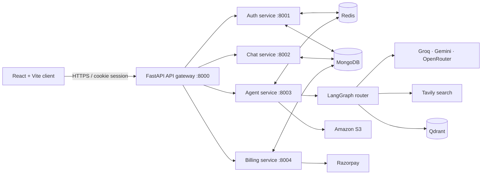

# Multi Ai Agent Platform

> A production-minded, multi-agent AI workspace for turning a single conversation into answers, research, code, documents, presentations, and images.

[](https://react.dev/)
[](https://fastapi.tiangolo.com/)
[](https://langchain-ai.github.io/langgraph/)
[](https://www.mongodb.com/)
[](https://redis.io/)
[](https://www.docker.com/)

GarvisAI is a full-stack AI product built around a clear product idea: users should be able to ask naturally, choose a specialist when they want control, and receive useful, durable output in the same workspace. It combines a polished React interface with a FastAPI microservice backend and a LangGraph-powered agent router.

## Why this project stands out

- **Agent orchestration over a single chat endpoint.** A LangGraph workflow classifies requests and routes them to specialised chat, search, coding, PDF, presentation, and image agents.
- **Useful artifacts, not just text.** The coding agent returns a multi-file project that can be inspected and previewed in-browser; document agents generate downloadable PDFs and PowerPoint decks.
- **Multimodal by design.** PDF uploads use retrieval-augmented generation (RAG), while image uploads are analysed with a vision-capable model.
- **Product-grade platform concerns.** Google sign-in, server-side Redis sessions, conversation persistence, short-term memory, per-agent rate limiting, credit metering, and Razorpay payment verification are all part of the implementation.
- **Service boundaries that scale.** The gateway, auth, chat, agent, and billing services have independent FastAPI applications, Dockerfiles, and ports.

## What users can do

| Capability | How it works |
| --- | --- |
| Conversational AI | Maintains conversation context using Redis-backed memory and persisted MongoDB messages. |
| Web research | Queries Tavily, then passes results to the chat agent for a grounded answer with related imagery. |
| Code generation | Produces structured project files, rendered in a Monaco-powered artifact panel with a sandboxed live preview. |
| PDF generation | Turns a prompt into a structured, professionally styled PDF and returns a time-limited S3 download link. |
| Presentation generation | Creates a branded PPTX deck with a cover, six content slides, and closing slide. |
| PDF intelligence | Chunks an uploaded PDF, embeds it in Qdrant, retrieves relevant passages, and answers strictly from the document. |
| Image generation & analysis | Generates images from an enhanced prompt or analyses uploaded images with a multimodal model. |
| Accounts & usage | Supports Google authentication, credit-based usage, per-agent request limits, and paid plan upgrades. |

## Architecture



### Request lifecycle

1. The React client authenticates with Firebase and exchanges the Firebase ID token for a secure, HTTP-only session cookie.
2. The gateway validates that session in Redis, injects the authenticated user ID, and forwards the request to the appropriate service.
3. The agent service routes the request to the right specialist. File type takes priority: PDFs go to the RAG pipeline and images go to the vision analyser.
4. The service applies rate limits and credits, persists both sides of the conversation, and caches the latest context in Redis for fast follow-up responses.
5. Rich results—code artifacts, generated files, images, and Markdown—return to the client for display in the conversation workspace.

## Tech stack

| Layer | Technologies | Versions in this project |
| --- | --- | --- |
| Client | React, Vite, Tailwind CSS, Redux Toolkit, Motion, Monaco Editor | React 19.2, Vite 8.1, Tailwind 4.3, Redux Toolkit 2.12 |
| API platform | Python, FastAPI, Uvicorn, HTTPX, Docker | Python 3.11+, FastAPI 0.115+, Uvicorn 0.34+, HTTPX 0.28+ |
| Agent system | LangGraph, LangChain, Groq, Google Gemini, OpenRouter, Tavily | LangGraph 0.3+, LangChain Core 0.3+ |
| Data & memory | MongoDB with Beanie/Motor, Redis, Qdrant vector search | Beanie 1.29+, Redis client 5.0+, Qdrant client 1.13+ |
| Identity & payments | Firebase Authentication, Razorpay | Firebase Web SDK 12.15+, Razorpay SDK 1.4+ |
| Generated output | ReportLab, python-pptx, Amazon S3 presigned URLs | ReportLab 4.3+, python-pptx 1.0+ |

## Repository structure

```text
garvis-ai/
├── frontend/                         # React chat workspace
│   ├── src/components/                # Chat, sidebar, billing, artifact preview
│   ├── src/redux/                     # User, conversations, and messages state
│   └── features/                      # Gateway API client operations
└── backend/
    ├── gateway/                       # Session-aware API gateway
    ├── shared/                        # Shared async Redis client
    └── services/
        ├── auth/                      # Firebase verification, users, credits
        ├── chat/                      # Conversation and message persistence
        ├── agent/                     # LangGraph workflow and AI specialists
        └── billing/                   # Razorpay orders and payment verification
```

## Local development

### Prerequisites

- Node.js 20+
- Python 3.11+ and [uv](https://docs.astral.sh/uv/) (or Python virtual environments with `pip`)
- MongoDB instance (local or Atlas)
- Redis 7+ (Docker is supported out of the box)
- Accounts/API keys for Firebase, Groq, Google AI Studio, OpenRouter, Tavily, Qdrant, AWS S3, and Razorpay

### 1. Start Redis

```bash
cd backend
docker compose up -d
```

### 2. Configure environment variables

Create a `.env` file in `frontend/`, `backend/gateway/`, and each backend service you run. Environment files stay local and are ignored by Git.

The services deliberately read their own `.env` files, which makes them easy to deploy independently. Use the following reference values for a local setup; replace every placeholder with your credentials.

```dotenv
# Shared backend configuration
MONGODB_URI=mongodb://localhost:27017/garvisai
REDIS_URL=redis://localhost:6379/0

# Gateway service
PORT=8000
FRONTEND_URL=http://localhost:5173
AUTH_SERVICE_URL=http://localhost:8001
CHAT_SERVICE_URL=http://localhost:8002
AGENT_SERVICE_URL=http://localhost:8003
BILLING_SERVICE_URL=http://localhost:8004

# Firebase Admin (auth service) — JSON must be a single valid JSON string
FIREBASE_SERVICE_ACCOUNT_JSON={"type":"service_account","project_id":"..."}

# AI and search (agent service)
GROQ_API_KEY=...
GOOGLE_API_KEY=...
OPENROUTER_API_KEY=...
TAVILY_API_KEY=...
QDRANT_URL=https://your-cluster.qdrant.io
QDRANT_API_KEY=...

# Object storage (agent service)
AWS_REGION=...
AWS_ACCESS_KEY_ID=...
AWS_SECRET_ACCESS_KEY=...
AWS_BUCKET_NAME=...

# Billing (billing service)
RAZORPAY_KEY_ID=...
RAZORPAY_KEY_SECRET=...
```

```dotenv
# frontend/.env
VITE_FIREBASE_API_KEY=...
VITE_FIREBASE_AUTH_DOMAIN=...
VITE_FIREBASE_PROJECT_ID=...
VITE_FIREBASE_STORAGE_BUCKET=...
VITE_FIREBASE_MESSAGING_SENDER_ID=...
VITE_FIREBASE_APP_ID=...
VITE_SERVER_URL=http://localhost:8000
VITE_FIREBASE_API_KEY=...
VITE_RAZORPAY_KEY_ID=...
```

> **Security note:** Do not put server credentials in `frontend/.env`. Variables prefixed with `VITE_` are bundled into the browser. Keep private Firebase, model-provider, database, AWS, and Razorpay-secret credentials in the backend only.

### 3. Install dependencies

In five terminals, install each Python project. `uv` resolves the shared Redis package through the local path configured in the service `pyproject.toml` files.

```bash
cd backend/gateway && uv sync
cd backend/services/auth && uv sync
cd backend/services/chat && uv sync
cd backend/services/agent && uv sync
cd backend/services/billing && uv sync
```

Install the client dependencies in a separate terminal:

```bash
cd frontend
npm install
```

### 4. Run the platform

Start each backend process from its own directory:

```bash
cd backend/gateway && uv run uvicorn main:app --reload --port 8000
cd backend/services/auth && uv run uvicorn main:app --reload --port 8001
cd backend/services/chat && uv run uvicorn main:app --reload --port 8002
cd backend/services/agent && uv run uvicorn main:app --reload --port 8003
cd backend/services/billing && uv run uvicorn main:app --reload --port 8004
```

Then launch the UI:

```bash
cd frontend
npm run dev
```

Open `http://localhost:5173`. The browser talks only to the gateway at port `8000`; the gateway owns the protected service routing.

## API surface

All client-facing endpoints are exposed through the API gateway.

| Route | Method | Purpose |
| --- | --- | --- |
| `/api/auth/login` | `POST` | Exchange a Firebase ID token for a session cookie. |
| `/api/auth/logout` | `GET` | End the current session. |
| `/api/me` | `GET` | Retrieve the authenticated user and current credits. |
| `/api/chat/create-conversation` | `GET` | Start a persisted conversation. |
| `/api/chat/get-conversations` | `GET` | List the signed-in user’s conversations. |
| `/api/chat/get-messages/:conversationId` | `GET` | Retrieve a conversation history. |
| `/api/agent/chat` | `POST` | Run an agent; accepts JSON or `multipart/form-data` with an image/PDF upload. |
| `/api/billing/create-order` | `POST` | Create a Razorpay order for a plan. |
| `/api/billing/verify-payment` | `POST` | Verify the payment signature and credit the account. |

## Agent routing

The UI can explicitly select an agent, or use **Auto** to delegate intent selection to the router model.

| Agent | Primary outcome | Rate limit |
| --- | --- | --- |
| `chat` | Context-aware conversational response | 20 requests/minute |
| `search` | Current web research followed by a grounded response | 5 requests/minute |
| `coding` | Code review, debugging, explanations, or runnable multi-file artifacts | 5 requests/minute |
| `pdf` | Generated PDF stored in S3 | 5 requests/minute |
| `ppt` | Generated PPTX stored in S3 | 5 requests/minute |
| `image` | Generated image stored in S3 | 5 requests/minute |
| `pdfRag` | Retrieval-grounded answer from an uploaded PDF | Subject to agent service limits |
| `imageAnalyzer` | Analysis and text extraction from an uploaded image | Subject to agent service limits |

## Production considerations

This repository includes Dockerfiles for the gateway and each service. Build from the `backend/` directory so the image can include `shared/`:

```bash
cd backend
docker build -f gateway/Dockerfile .
docker build -f services/agent/Dockerfile .
```

Before a public deployment, configure a production MongoDB/Redis provider, an HTTPS origin, and environment-specific CORS settings. The auth cookie is currently configured for local development (`secure=False`); set it to secure cookies behind HTTPS in production. Keep payment verification server-side, rotate credentials regularly, and use least-privilege IAM credentials for the S3 bucket.

## Product decisions worth noting

- **Fast follow-ups without sacrificing persistence:** Redis caches the last 20 conversation messages while MongoDB remains the system of record.
- **File-aware routing:** user uploads bypass ambiguous intent classification and enter the document or vision workflow directly.
- **Bounded usage:** Redis counters protect expensive model routes, while credits make AI consumption visible and monetisable.
- **A tangible coding experience:** generated files are not flattened into Markdown—they are rendered as an editable-style artifact workspace with syntax highlighting and preview.

---

<div align="center">

&copy; 2026 **Garv R Changrani**. All rights reserved.<br>
*Engineered for scalable, intelligent multi-agent orchestration.*

</div>